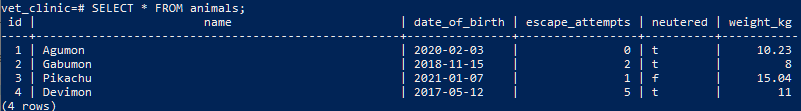

# Vet clinic. Databases project

> On this project I'll build a database using PostgreSQL, the database theme is a vet clinic

## Built With

- PostgreSQL

## Getting Started

### Prerequisites

- PostgreSQL

### Setup

- Clone the repository with git clone https://github.com/leolpaz/vet_clinic.git;
- Create a database, you can follow the [getting started](https://www.postgresql.org/docs/current/tutorial-start.html) section on the PSQL website
- Access your created database

### Usage

- Run \i  path/schema.sql to create the table
- Run \i path/data.sql to insert the 4 example animals
- Run \i path/queries.sql to run the example queries
- Note: Be careful if you're copying the path from windows explorer as the path will be written as "drive:\path\to\folder\file_name.sql" and you'll likely get a "permission denied" error, use slashes instead of backslashes for the file address like "\i drive:/path/to/folder/file_name.sql"

## Author

👤 **Leonardo Paz**

- Github: [Leonardo Paz](https://github.com/leolpaz)
- Twitter: [Leonardo Paz](https://twitter.com/leonardolpaz95)
- Linkedin: [Leonardo Paz](https://www.linkedin.com/in/leonardolpaz/)

## 🤝 Contributing

Contributions, issues, and feature requests are welcome!

Feel free to check the [issues page](../../issues/).

## Show your support

Give a ⭐️ if you like this project!

## Acknowledgments

- Hat tip to anyone who's code was used
- Microverse

## 📝 License

This project is [MIT](./MIT.md) licensed.
